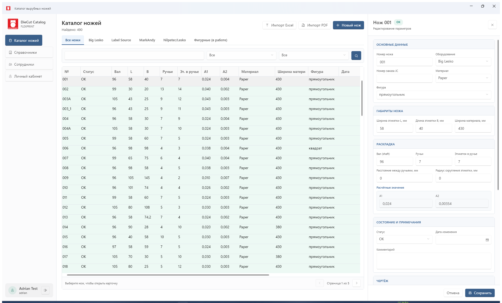

# DieCut Catalog

**DieCut Catalog** — сетевая система FLEXPRINT для хранения, поиска и производственного учёта вырубных ножей. Windows-клиенты работают с единым API на Ubuntu-сервере; PostgreSQL хранит карточки, сотрудников и историю событий, а PDF-чертежи находятся в управляемом серверном хранилище.

Текущая стабильная версия: **1.1.1**.



## Что умеет система

- каталог ножей с вкладками по оборудованию, поиском и фильтрами;
- карточка ножа с техническими параметрами, статусом, заказом JC и комментарием;
- статусы **OK**, **Требует проверки**, **Списан**, **Заказать новый** с цветовой индикацией;
- ввод производственного ресурса по тиражу в штуках или по пробегу в метрах с автоматическим взаимным пересчётом и вычислением целых оборотов;
- автоматический перевод ножа в статус **Требует проверки** при достижении заданного ресурса;
- импорт действующего Excel-каталога с нормализацией legacy-названий оборудования;
- создание, загрузка, скачивание и хранение версий PDF-чертежей;
- предварительное распознавание параметров при импорте PDF;
- справочники материалов, фигур и оборудования;
- личный кабинет и справочник сотрудников с историей действий;
- общий журнал с экспортом в CSV и PDF;
- разграничение прав и подтверждение опасных операций паролем администратора;
- аудит успешных входов и штатных выходов клиентов.

## Интерфейс

### Каталог и карточка ножа

Таблица показывает только поля, необходимые для ежедневной работы: номер, статус, вал, L, B, ручьи, этикетки в ручье, A1, A2, материал, ширину материала, фигуру, дату, оборудование, заказ JC, обороты и комментарий. Выбор строки открывает подробную карточку справа.


Оборудование выбирается из справочника. Базовый набор: **Nilpeter/Lesko**, **MarkAndy**, **Big Lesko**, **Label Source**. Поддерживаются фигуры: прямоугольник, круг, квадрат, специальная форма и перфорация.

### Справочники и журнал

Администратор может дополнять и корректировать материалы, фигуры и оборудование. Общий журнал содержит действия с ножами, тиражами, PDF, а также входы и выходы сотрудников. Журнал доступен для поиска и экспорта.


### Сотрудники

Личный кабинет хранит фотографию, контакты, должность, электронную почту и параметры учётной записи. В справочнике сотрудников отображается история работы: создание и изменение ножей, ввод тиражей, формирование PDF, удаление, вход и выход из системы.


## Учёт тиража и ресурса

Пользователь вводит только тираж этикеток в штуках. Остальные значения рассчитываются и накапливаются автоматически.

```text
Пробег, м =
  тираж / количество ручьёв
  × (длина этикетки B, мм + horizontal break, мм)
  / 1000

Раппорт, м = вал × 3,175 / 1000

Обороты = округление вверх(пробег / раппорт)
```

Обороты всегда сохраняются целым числом. Каждая операция содержит дату, сотрудника, тираж и значения до/после. Сброс ресурса выполняется только после установки нового ножа.

## PDF-чертежи

Генератор создаёт векторный PDF в масштабе 1:1 по параметрам карточки:

- контур этикетки соответствует размерам L × B;
- учитываются ручьи, этикетки в ручье, раппорт и ширина материала;
- применяются радиус скругления и межэтикеточные расстояния;
- выводятся **Corner radius**, **vertical break** и **horizontal break**;
- каждая версия сохраняется отдельно и регистрируется в журнале.

Можно прикрепить существующий PDF или импортировать схему для предварительного извлечения параметров. Распознанные данные всегда подтверждаются пользователем перед созданием ножа.

## Безопасность и аудит

- клиент не подключается напрямую к PostgreSQL или папке PDF;
- все операции проходят через HTTPS API с серверной валидацией;
- сервер хранит хеши паролей, а не исходные пароли;
- временный пароль нового сотрудника генерируется сервером и отправляется через SMTP;
- удаление ножа или сотрудника, списание и сброс ресурса требуют пароль администратора в **Danger Zone**;
- успешный вход и штатный выход клиента сохраняются в базе и видны в журналах;
- API ограничивает частоту попыток авторизации.

> При аварийном отключении питания или сети точное время выхода определить невозможно. Оно фиксируется при штатном выходе или закрытии клиента.

## Архитектура

```text
Windows-клиент WPF
        |
      HTTPS
        |
Caddy на Ubuntu
        |
ASP.NET Core API
   |             |
PostgreSQL   PDF-хранилище
```

- **.NET 8 / ASP.NET Core** — API и бизнес-логика;
- **WPF + WPF UI** — Windows 10/11 клиент;
- **PostgreSQL 16** — каталог, сотрудники, события и метаданные;
- **Docker Compose** — развёртывание сервера;
- **Caddy** — HTTPS и reverse proxy;
- **PDFsharp / PdfPig / ClosedXML** — PDF и Excel.

## Структура решения

- `DieCutCatalog.Api` — HTTP API и серверные endpoints;
- `DieCutCatalog.Domain` — бизнес-модель и правила учёта;
- `DieCutCatalog.Application` — контракты и сценарии приложения;
- `DieCutCatalog.Infrastructure` — PostgreSQL, Excel, PDF, SMTP и файлы;
- `DieCutCatalog.Desktop` — Windows-клиент;
- `tests/DieCutCatalog.Infrastructure.Tests` — интеграционные тесты бизнес-логики.

## Быстрый запуск для разработки

Требуются .NET 8 SDK и Docker.

```powershell
docker compose up -d postgres
dotnet restore
dotnet run --project src/DieCutCatalog.Api
```

API: `http://localhost:5080`. Проверка состояния: `GET /health`.

Запуск клиента:

```powershell
dotnet run --project src/DieCutCatalog.Desktop
```

Автономная Windows-сборка:

```powershell
dotnet publish src/DieCutCatalog.Desktop -c Release -r win-x64 `
  --self-contained true -p:PublishSingleFile=true -o artifacts/client
```

## Production

Сервер разворачивается на Ubuntu через `compose.production.yaml`. Секреты передаются через серверный `.env` и не должны попадать в Git.

```bash
cp .env.example .env
docker-compose -f compose.production.yaml up -d --build
curl http://127.0.0.1:5080/health
```

API должен слушать только loopback-интерфейс и публиковаться наружу через HTTPS reverse proxy. Текущий тестовый адрес: [https://diecutcatalog.duckdns.org](https://diecutcatalog.duckdns.org).

## Документация

- [Полная инструкция по установке и эксплуатации](docs/installation-and-user-guide.md)
- [Архитектура](docs/architecture.md)
- [План MVP](docs/mvp.md)
- [История версий](CHANGELOG.md)

## История версий

### 1.1.1 — 30 июля 2026

**HOTFIX-004:** после сохранения карточки каталог сохраняет текущую страницу. Переход на страницу 1 выполняется только при переносе ножа на другую вкладку оборудования.

### 1.1.0 — 30 июля 2026

Добавлен двусторонний учёт производственного ресурса: оператор выбирает ввод тиража в штуках или пробега в погонных метрах. Система рассчитывает второй показатель и целое количество оборотов, проверяет взаимоисключающий ввод и сохраняет результаты в общей истории ножа.

### 1.0.3 — 30 июля 2026

**HOTFIX-003:** исправлен прямой переход из справочника сотрудников в справочники. Строки сотрудников выровнены по высоте, длинные должности переносятся на две строки без обрезания.

### 1.0.2 — 27 июля 2026

**HOTFIX-002:** текст и заголовки во всех таблицах выровнены по центру. В справочнике сотрудников длинные названия должностей отображаются в две строки шрифтом на один пункт меньше.

### 1.0.1 — 27 июля 2026

**HOTFIX-001:** исправлен расчёт A1 с учётом расстояний между ручьями. Отрицательная геометрия подсвечивается красным и блокирует сохранение и генерацию PDF; существующие значения A1 пересчитываются миграцией. Подробности приведены в [CHANGELOG.md](CHANGELOG.md).
### 1.0.0 — 27 июля 2026

Первый стабильный релиз: сетевой каталог, учёт тиража и ресурса, Excel/PDF-импорт, параметрические чертежи прямоугольных, квадратных и круглых ножей, справочники, сотрудники, аудит и защищённые административные операции. Полный список изменений приведён в [CHANGELOG.md](CHANGELOG.md).

## Текущее состояние

Рабочая сетевая версия включает авторизацию, каталог и карточки ножей, Excel/PDF-импорт, справочники, сотрудников, учёт тиража и ресурса, аудит действий и сессий, PDF-хранилище и параметрическую генерацию схем. Изменения проверяются автоматическими тестами и развёрнуты на тестовом Ubuntu-сервере.
