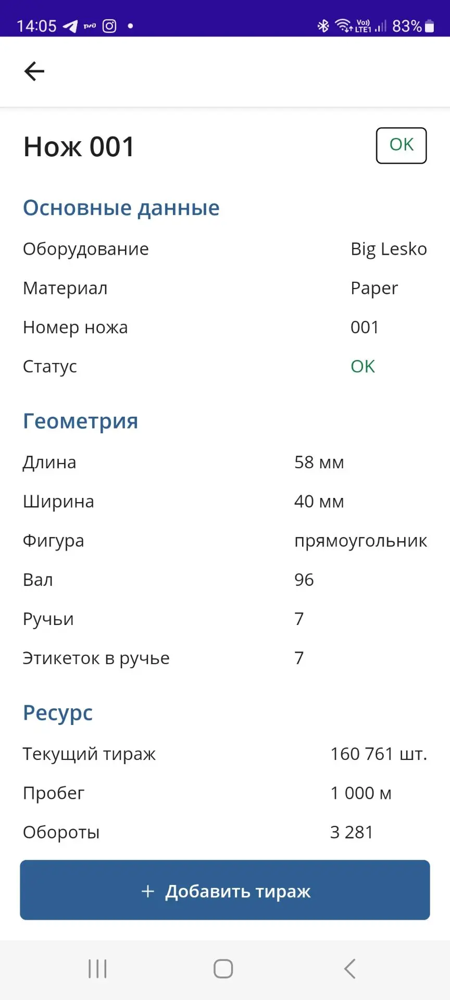
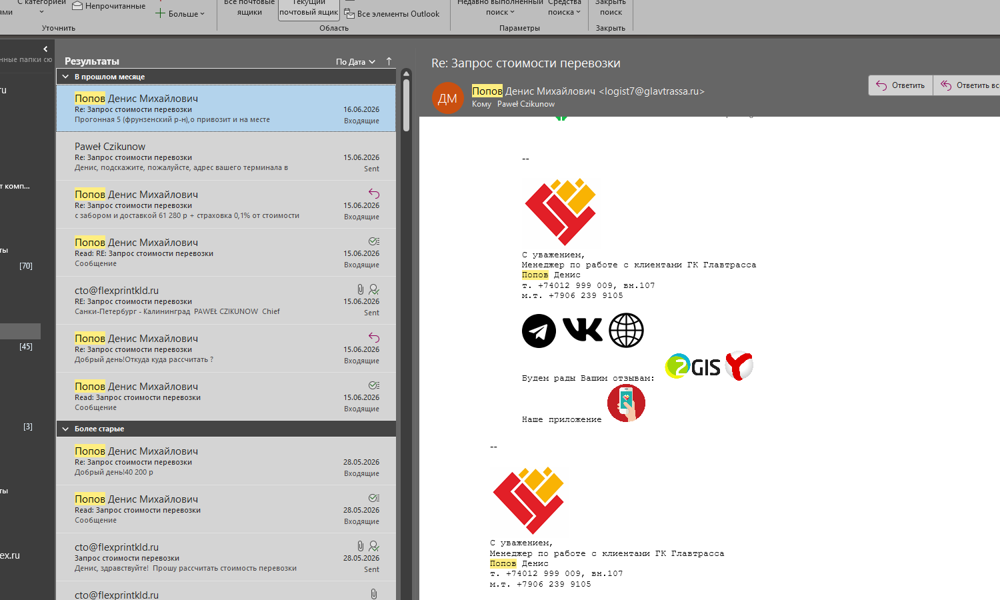
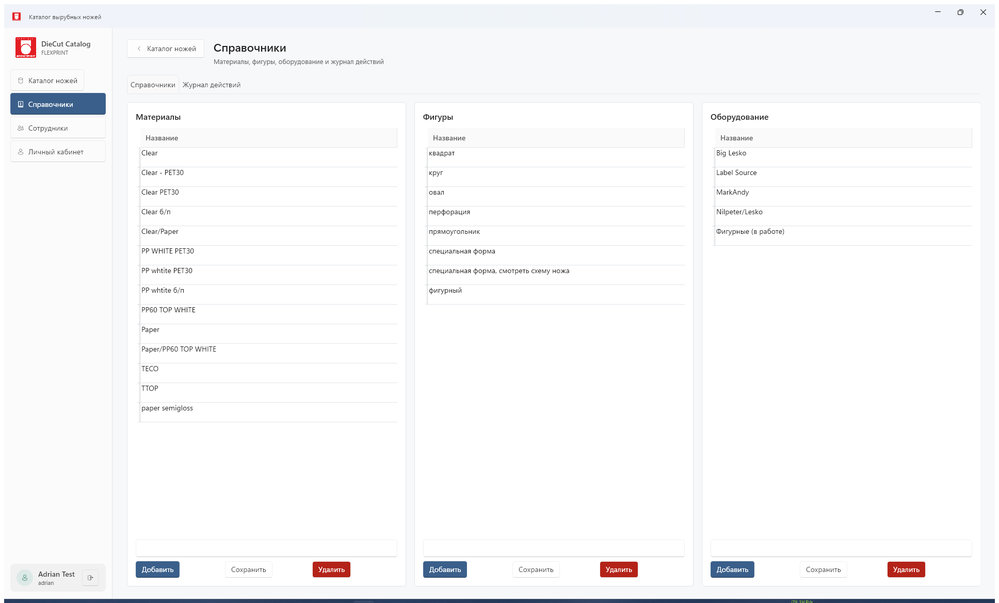
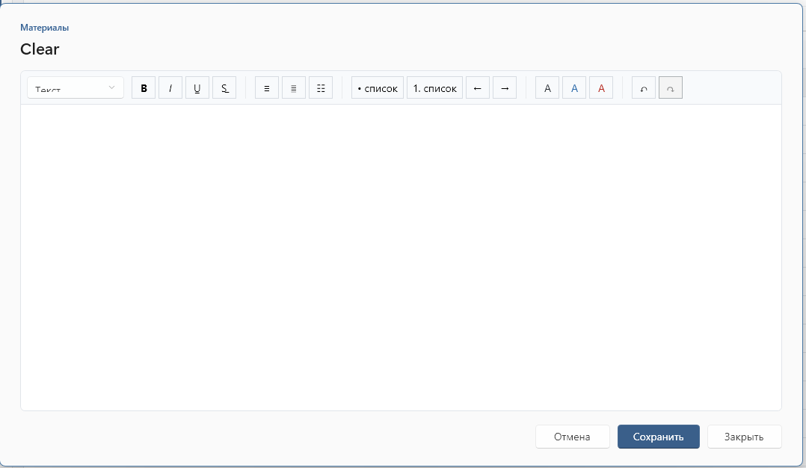
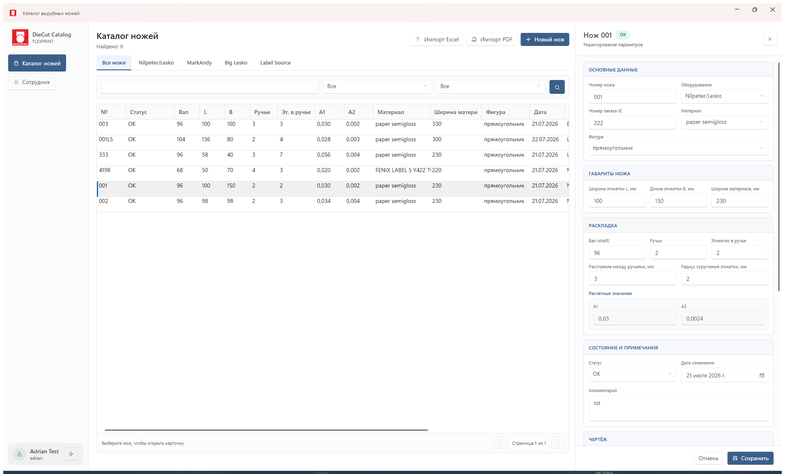
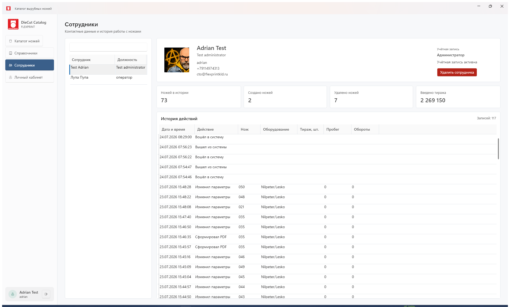

# DieCut Catalog: установка и работа

Актуально на 31 июля 2026 года.

DieCut Catalog — сетевая система FLEXPRINT для хранения, поиска и производственного учёта вырубных ножей. Полный Windows-клиент и облегчённое Android-приложение работают с единым HTTPS API на Ubuntu-сервере. PostgreSQL хранит карточки, сотрудников и журнал событий, PDF-чертежи находятся в серверном файловом хранилище.

## Возможности

- каталог с вкладками по оборудованию, поиском и фильтрами;
- карточка ножа и статусы **OK**, **Требует проверки**, **Списан**, **Заказать новый**;
- учёт тиража в штуках, погонных метрах и оборотах;
- журнал тиражей, сбросов, списаний и PDF;
- импорт Excel и PDF;
- генерация векторного PDF в масштабе 1:1;
- сотрудники, фотографии, контакты, смена почты и пароля;
- административное подтверждение опасных операций.

## Архитектура

~~~text
Windows-клиент WPF     Android-клиент MAUI
        \                  /
                 HTTPS
                   |
Ubuntu + reverse proxy
        |
ASP.NET Core API
   |             |
PostgreSQL   PDF-хранилище
~~~

Клиент не подключается напрямую к PostgreSQL и папке PDF. Все изменения проходят через API, который проверяет права, валидирует данные и записывает события в журнал.

## Требования

**Сервер:** Ubuntu Server 22.04/24.04 LTS, 2 CPU, 2 ГБ RAM (лучше 4 ГБ), от 20 ГБ диска, домен, порты 22/80/443, Docker Engine, Docker Compose plugin и SMTP.

**Windows-клиент:** Windows 10/11 x64, доступ к HTTPS API, экран от 1600×900 и PDF-просмотрщик. Illustrator нужен только для проверки или обработки схем.

**Android-клиент:** Android 10 (API 29) или новее, доступ к HTTPS API и разрешение на установку APK из выбранного источника.

> Рабочим пользователям не нужны Docker, PostgreSQL и .NET SDK.

## Установка Ubuntu-сервера

### 1. Подготовка

~~~bash
sudo apt update
sudo apt upgrade -y
sudo apt install -y ca-certificates curl git
~~~

Docker устанавливайте из официального репозитория: https://docs.docker.com/engine/install/ubuntu/

~~~bash
sudo systemctl enable --now docker
docker --version
docker compose version
~~~

### 2. Проект

~~~bash
sudo mkdir -p /opt/diecut-catalog
sudo chown "$USER":"$USER" /opt/diecut-catalog
git clone https://github.com/wargie/DieCutCatalog.git /opt/diecut-catalog
cd /opt/diecut-catalog
~~~

### 3. Секреты

~~~bash
cp .env.example .env
chmod 600 .env
nano .env
~~~

~~~dotenv
POSTGRES_PASSWORD=СЛУЧАЙНЫЙ_ДЛИННЫЙ_ПАРОЛЬ
ACCOUNT_SETUP_TOKEN=СЛУЧАЙНЫЙ_ТОКЕН
SMTP_HOST=smtp.example.com
SMTP_PORT=587
SMTP_USERNAME=mailer@example.com
SMTP_PASSWORD=ПАРОЛЬ_SMTP
SMTP_FROM_ADDRESS=mailer@example.com
SMTP_FROM_NAME="DieCut Catalog"
SMTP_ENABLE_SSL=true
JUSTCUT_BASE_URL=http://api1c.justcut.ru:8081/jctest/hs/jcexch/
JUSTCUT_UID_CONTRAGENT=ИДЕНТИФИКАТОР_КОНТРАГЕНТА
JUSTCUT_ENVIRONMENT=Test
JUSTCUT_TIMEOUT_SECONDS=60
~~~

Генерация секрета: **openssl rand -base64 36**.

> Файл .env нельзя отправлять в Git, прикладывать к письмам или хранить с пользовательской инструкцией.

### 4. Запуск

~~~bash
cd /opt/diecut-catalog
docker compose -f compose.production.yaml up -d --build
docker compose -f compose.production.yaml ps
curl http://127.0.0.1:5080/health
~~~

Корректный ответ: **"Healthy"**. API слушает только **127.0.0.1:5080**; не открывайте этот порт напрямую наружу.

### 5. HTTPS

Рекомендуется Caddy: https://caddyserver.com/docs/install

~~~caddyfile
catalog.example.com {
    reverse_proxy 127.0.0.1:5080
}
~~~

~~~bash
sudo caddy validate --config /etc/caddy/Caddyfile
sudo systemctl reload caddy
curl https://catalog.example.com/health
~~~

DNS домена должен указывать на сервер. Для временной проверки допустим SSH-туннель **ssh -N -L 5080:127.0.0.1:5080 user@server**, для постоянной работы используйте HTTPS.

Текущий адрес FLEXPRINT: **https://diecutcatalog.duckdns.org**. Caddy установлен как системная служба и автоматически получает и продлевает сертификат Let''s Encrypt.

### 6. Первый администратор

~~~bash
curl -X POST https://catalog.example.com/api/setup/administrator \
  -H "Content-Type: application/json" \
  -H "X-Setup-Token: ЗНАЧЕНИЕ_ACCOUNT_SETUP_TOKEN" \
  -d '{
    "email": "admin@example.com",
    "firstName": "Имя",
    "lastName": "Фамилия",
    "position": "Администратор",
    "phone": "+7..."
  }'
~~~

Временный пароль приходит по почте. Новый пароль: минимум 12 символов, заглавная и строчная буквы, цифра и специальный символ. После создания администратора замените setup token и выполните **docker compose -f compose.production.yaml up -d api**.
## Windows-клиент

На ПК сборки установите .NET 8 SDK:

~~~powershell
git clone https://github.com/wargie/DieCutCatalog.git
cd DieCutCatalog
dotnet restore
./scripts/Build-ClientRelease.ps1 -Version 1.4.0
~~~

Папку **artifacts\client** упакуйте в ZIP. На рабочих ПК распакуйте, например, в **C:\Program Files\FLEXPRINT\DieCut Catalog** и запускайте **DieCutCatalog.Desktop.exe**.

> При обновлении закройте клиент и замените всю папку. База и PDF находятся на сервере и не затрагиваются.

## Android-клиент

Android дополняет ПК-версию и использует ту же базу и учётные записи. На телефоне доступны просмотр каталога и карточек, фильтры оборудования, компактный и подробный режим, ввод тиража или пробега и редактирование своего профиля. Создание ножей, PDF, справочники и административные операции выполняются в Windows-клиенте.

### Установка готового APK

1. На телефоне откройте [GitHub Release Android 0.2.0](https://github.com/wargie/DieCutCatalog/releases/tag/android-v0.2.0).
2. Скачайте `DieCutCatalog-Android-0.2.0.apk`.
3. Если Android запросит разрешение, разрешите установку приложений из браузера или файлового менеджера, которым открыт APK.
4. Нажмите **Установить**, затем запустите **DieCut Catalog**.
5. При следующем обновлении установите новый APK поверх текущего. Каталог и история не потеряются: они находятся на сервере.

Production-адрес `https://diecutcatalog.duckdns.org` уже встроен в Android-приложение. Перед входом можно проверить [https://diecutcatalog.duckdns.org/health](https://diecutcatalog.duckdns.org/health): сервер должен ответить `Healthy`.

### Первый запуск Android

1. Введите ту же электронную почту и пароль, которые используются на ПК.
2. Если учётная запись требует смены временного пароля, сначала выполните смену в Windows-клиенте.
3. Выберите группу оборудования или найдите нож по номеру.
4. Кнопка вида переключает компактные строки и подробные карточки.
5. Нажатие на аватар открывает личный профиль. Сохранение профиля подтверждается повторным вводом собственного пароля через **Danger Zone**.

### Добавление ресурса с телефона

1. Откройте карточку нужного ножа и проверьте номер, оборудование, материал и геометрию.
2. Нажмите **Добавить тираж**.
3. Выберите один способ ввода: **Тираж, шт.** или **Пробег, м**.
4. Введите только выбранное значение. Приложение покажет предварительный пересчёт второго значения и оборотов.
5. Нажмите **Подтвердить**. Окончательный расчёт выполняется сервером и сразу отображается в Windows-клиенте.

> Не вводите одновременно тираж и пробег: режимы являются альтернативными представлениями одной операции.

### Обновление Android

Актуальный APK публикуется в GitHub Releases с тегом вида `android-v0.2.0`. До завершения пилотной эксплуатации мобильные версии помечаются как prerelease. Подробная инструкция для разработчика: [android-development.md](android-development.md).

## Первый вход

1. Введите HTTPS-адрес API, например **https://catalog.example.com**.
2. Введите электронную почту и пароль.
3. Нажмите **Войти**.
4. При первом входе замените временный пароль.

> При ошибке соединения откройте адрес **/health** в браузере. Должен быть ответ **"Healthy"** без предупреждения о сертификате.

## Каталог

Подсказки:

1. Вкладки **Все ножи**, **Nilpeter/Lesko**, **MarkAndy**, **Big Lesko**, **Label Source** ограничивают список по оборудованию.
2. Поиск работает по номеру, оборудованию, материалу и комментарию.
3. Выпадающие списки фильтруют каталог.
4. **Импорт Excel** загружает существующий каталог.
5. **Импорт PDF** распознаёт схему и открывает карточку для проверки.
6. **Новый нож** создаёт пустую карточку.
7. Щелчок по строке открывает карточку справа.

Порядок колонок: **№, Статус, Вал, L, B, Ручьи, Эт. в ручье, A1, A2, Материал, Ширина материала, Фигура, Дата, Оборудование, Заказ JC, Обороты, Комментарий.**

Целые значения показываются без нулевой дробной части. A1 и A2 отображаются с точностью до трёх знаков.

## Справочники

Системные списки **Материалы**, **Фигуры** и **Оборудование** используются непосредственно в карточке ножа. Пользовательские справочники администратор создаёт без изменения программы и при необходимости объединяет в группы. Щелчок по заголовку группы раскрывает или сворачивает входящие в неё списки; пустая группа остаётся видимой.

### Группы и списки

1. В поле **Новая группа** введите название и нажмите **Добавить**.
2. Нажмите **Новый справочник**, задайте название и выберите группу.
3. Чтобы удалить группу, нажмите по её заголовку правой кнопкой мыши и выберите **Удалить группу**.
4. В окне **Danger Zone** текущий администратор вводит собственный пароль. Удалить можно только пустую группу: сначала перенесите или удалите входящие справочники.

### Значения и CSV

Значение можно добавить вручную либо загрузить кнопкой **Импорт CSV**. Поддерживаются CSV-файлы UTF-8 и распространённые Windows-кодировки; первая строка может быть заголовком `Название`, `Name` или `Value`. Пустые строки и уже существующие значения пропускаются, а результат импорта показывает число добавленных и пропущенных строк.

Правый щелчок по значению открывает команды **Просмотреть**, **Редактировать**, **Удалить**, **Дублировать в текущий раздел**, **Копировать в…** и **Перенести в…**. Последние две команды позволяют выбрать целевой пользовательский справочник.

### Карточка-статья

Двойной щелчок открывает карточку значения в режиме чтения. Ссылка **Редактировать** включает редактор с заголовками, начертанием, цветом, списками, выравниванием, ссылками и отменой/повтором. Кнопка **Сохранить** записывает форматированную статью на сервер; **Отмена** возвращает сохранённую версию.

## Карточка ножа

Карточка содержит номер, заказ JC, оборудование, материал, фигуру, L, B, ширину материала, вал, ручьи, этикетки в ручье, расстояние между ручьями, радиус, A1, A2, статус, дату, комментарий, тираж, пробег, обороты, PDF и журнал.

Оборудование: **Nilpeter/Lesko, MarkAndy, Big Lesko, Label Source**.

Фигуры: **прямоугольник, круг, квадрат, специальная форма, перфорация**.

> Вал — только целое положительное число.

## Учёт тиража

В Windows и Android можно ввести одно из двух значений: тираж этикеток в штуках или пробег в метрах. Второе значение и целые обороты сервер рассчитывает автоматически.

~~~text
Пробег, м =
  тираж / количество ручьёв
  × (длина этикетки B, мм + horizontal break, мм)
  / 1000

Раппорт, м = вал × 3,175 / 1000

Обороты = округление вверх(пробег / раппорт)
~~~

Обороты всегда целые. Операция фиксируется в журнале с датой, сотрудником, способом ввода и значениями до/после. Результат одинаков для обоих клиентов, поскольку расчёт выполняется API.

**Сбросить тираж**, **Списать нож** и **Удалить нож** доступны только администратору и требуют повторного ввода его собственного пароля. Оператор не может подтвердить операцию паролем другого пользователя.

## PDF

**Создать PDF** формирует новую векторную версию в масштабе 1:1:

- контур соответствует L × B;
- рамка соответствует ширине материала;
- раппорт равен вал × 3,175 мм;
- учитываются ручьи, повторения, расстояние и радиус;
- выводятся Corner radius, vertical break и horizontal break.

Каждая генерация создаёт отдельный PDF и событие журнала. Старые версии не перезаписываются. **Загрузить PDF** прикрепляет схему к ножу. **Импорт PDF** создаёт новую карточку, но распознанные значения обязательно проверяются пользователем.

> В Illustrator проверяйте размер самого векторного контура, а не страницы или группы объектов.

## Сотрудники

Администратор создаёт сотрудника по электронной почте. Сервер отправляет временный пароль через SMTP. В профиле можно изменить имя, должность, телефон, контакты, фото, электронную почту и пароль. Поддерживаются JPEG, PNG, WebP до 5 МБ.

В системе доступны только две роли:

- **Оператор** — просмотр каталога и журналов, ввод тиража или пробега, создание и редактирование карточек, загрузка и генерация PDF;
- **Администратор** — все права оператора, а также изменение справочников, импорт Excel, управление сотрудниками и выполнение операций **Danger Zone**.

Отдельных ролей технолога и пользователя только для просмотра нет. Опасные операции и доступ к справочнику сотрудников дополнительно подтверждаются паролем администратора.
## Резервное копирование

Резервировать нужно PostgreSQL и PDF-хранилище.

### PostgreSQL

~~~bash
mkdir -p /opt/backups/diecut
docker compose -f /opt/diecut-catalog/compose.production.yaml exec -T postgres \
  pg_dump -U diecut_catalog -d diecut_catalog -Fc \
  > /opt/backups/diecut/database-$(date +%F).dump
~~~

### PDF

~~~bash
docker run --rm \
  -v diecut-catalog_document-storage:/data:ro \
  -v /opt/backups/diecut:/backup \
  alpine \
  tar -czf /backup/documents-$(date +%F).tar.gz -C /data .
~~~

Имя volume проверьте через **docker volume ls**. Храните вторую копию вне сервера и регулярно проверяйте восстановление.

## Обновление

~~~bash
cd /opt/diecut-catalog
git pull --ff-only
docker compose -f compose.production.yaml up -d --build
curl http://127.0.0.1:5080/health
~~~

Перед крупным обновлением сделайте резервную копию базы и PDF.

## Диагностика

~~~bash
docker compose -f compose.production.yaml ps
docker compose -f compose.production.yaml logs --tail=200 api
docker compose -f compose.production.yaml logs --tail=200 postgres
curl http://127.0.0.1:5080/health
~~~

Если не приходит временный пароль, проверьте SMTP и выполните:

~~~bash
docker compose -f compose.production.yaml up -d --force-recreate api
~~~

Коды:

- **401** — войдите повторно;
- **403** — недостаточно прав;
- **429** — слишком много попыток входа, подождите минуту;
- **500** — проверьте журнал API за время ошибки.

Не отправляйте пароли и содержимое .env в отчёте об ошибке.

## Контрольный список

- [ ] Сервер защищён SSH-ключами.
- [ ] Docker и Compose установлены.
- [ ] .env заполнен и имеет права 600.
- [ ] Контейнеры работают.
- [ ] /health возвращает "Healthy".
- [ ] HTTPS-сертификат действителен.
- [ ] Создан первый администратор.
- [ ] SMTP доставляет временные пароли.
- [ ] Клиент запускается минимум на двух ПК.
- [ ] Проверены импорт Excel и PDF.
- [ ] Создан и открыт тестовый PDF.
- [ ] Проверены тираж и журнал.
- [ ] Проверена резервная копия.

## Ссылки

- Репозиторий: [github.com/wargie/DieCutCatalog](https://github.com/wargie/DieCutCatalog)
- Актуальный Windows-релиз: [DieCut Catalog 1.9.2](https://github.com/wargie/DieCutCatalog/releases/tag/v1.9.2)
- Скачать Windows-клиент: [DieCutCatalog-1.9.2-win-x64.zip](https://github.com/wargie/DieCutCatalog/releases/download/v1.9.2/DieCutCatalog-1.9.2-win-x64.zip)
- Рабочий сервер: [diecutcatalog.duckdns.org](https://diecutcatalog.duckdns.org)
- Docker Engine: https://docs.docker.com/engine/install/ubuntu/
- Docker Compose: https://docs.docker.com/compose/install/linux/
- Caddy: https://caddyserver.com/docs/install
- Архитектура: [docs/architecture.md](architecture.md)
